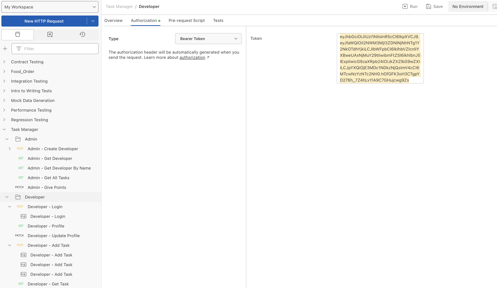
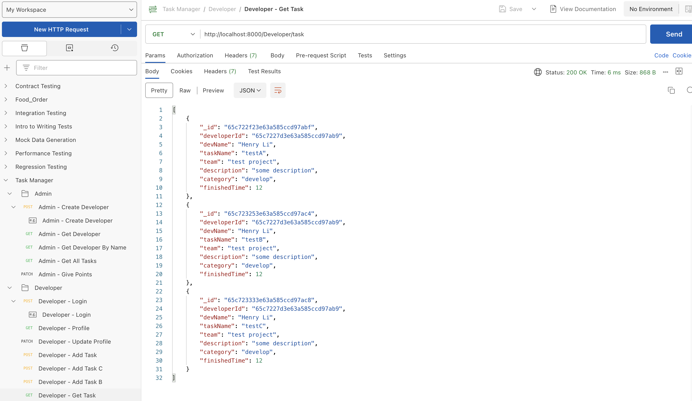

# ⛏️TaskManager⛏️

## The problem being solved

- **Development:** "We want to gamify the work our developers do for the team. If only we had a platform to log tasks and features that each dev completes and deal out points..."

## The app and its value proposition

- This software is a simple login platform and task manager.

- Globally, the project is the backend part of the software, produced in the **typescript and Node.js**, and takes a modular form of file management, giving the program modularity and readability.

- First of all, in the base module, this project uses the **MVC Pattern**, but because the app has no frontend, there is no View implementation.

  1. Templates for Task and Developer are created in the Model folder. The Task template is also an element of Developer's "tasks" property.

  2. The controller is divided into Administer Controller and Developer Controller.

     - **Administer Controller**: Users can administer accounts, and the VandyHacks administrators can check user data and rate the user's tasks.

     - **Developer Controller**: Developer can log in to their account, create tasks, view their tasks, and etc.

  3. The route handler is also divided into Admin and Developer parts. The Route defines the endpoints of the API and associate them with controller functions.

- Second, the **Data Transfer Object (dto)**. This section contains all the properties in task and developer that need to be requested in the controller, which helps to transfer data and reduce calls.

- Besides, the **Utility** section includes methods for randomly generating salt, using salt to hash passwords, generating signatures unique to each user, and verifying signatures.

- Finally, the **Config and Middleware**. The config stores the Url of MongoDb and the salt used for signature. The middleware gives the authenticate function that would be used in Controllers to varify the user's signature. These two parts match the pattern of **Configuation File Pattern** and **Middleware Design Pattern**, and this is the reason why the functions are seperated into the two folder.

## Run and test

- The "nodemon index.ts" is added into the package.json, so "npm start" command can be used to start the project.

- **Test the Register Machine**

  

- **Test the Login Machine**

  

- **Use the correct token (signature)**

  

- **Add a task to the developer**

  

- **Get tasks of a specific developer**

  

- **Get tasks of all developers**

  

- **Give points to specific task**

  

## Additional features/enhancements to implement

- A great UI is necessary, which needs to create a frontend by using react.

- The properties of developer can be more diverse.

- Give the administer a method to sort the tasks and developers according to the points.
